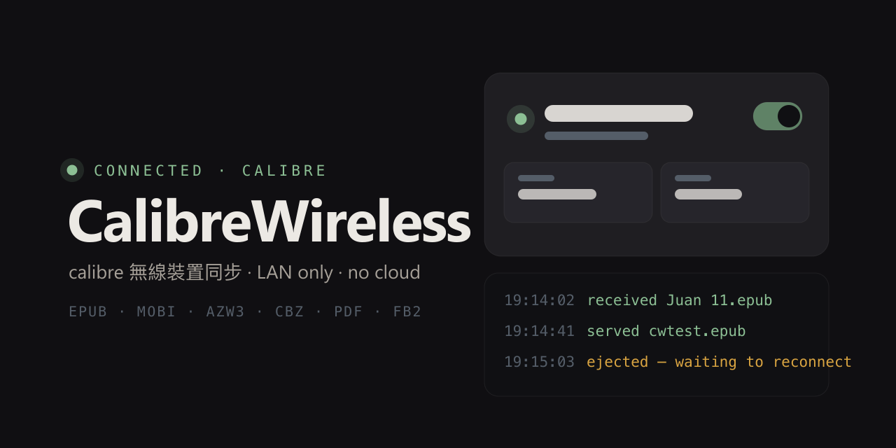
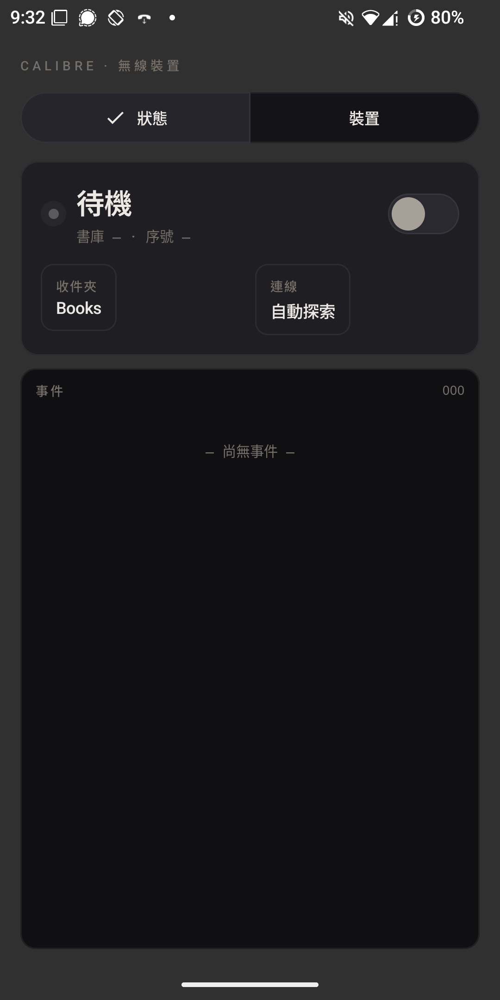
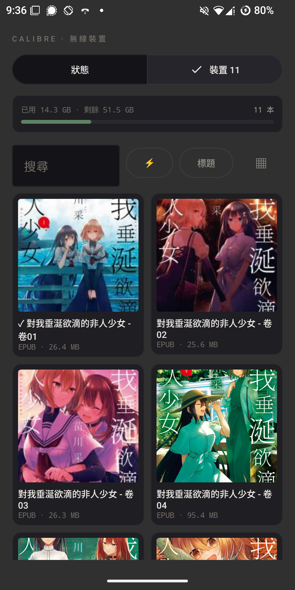

# CalibreWireless

Turn your Android phone, tablet or e-ink reader into a **wireless calibre device** —
the same "Android wireless device" protocol calibre uses for connected readers.
Books flow from your calibre library over the LAN; the phone manages its side locally.
No cloud, no account, no internet.

> **How it works:** calibre's smart-device protocol is *host-driven* — calibre is the
> master and the app is the emulated device (like a USB stick that happens to live on
> your Wi-Fi). Pushing books happens in calibre's GUI; the phone app keeps the
> connection alive, receives books, serves files back, and gives you a local book
> manager with covers, series shelves, storage analytics and read-status sync.

## Screenshots

| Status panel | Device library |
|---|---|
|  |  |

## Features

- **Wireless device emulation** — calibre smart-device protocol (JSON over TCP,
  `<len>[opcode, payload]` framing, UDP discovery, optional password auth via
  `sha1(password + challenge)`), verified against calibre 7.10 → 9.15 source
- **Receive books** from calibre's *Send to device* — straight into your chosen
  inbox folder (SAF), with zombie-tail-proof metadata
- **Offer books to the library** — drop files into the inbox and they appear in
  calibre's device view (EPUB OPF / PDF docinfo metadata parsed locally)
- **Local book manager** — list / cover grid / series shelf views, search, sort,
  multi-select (long-press), delete, open-in-reader, storage bar + analytics
  (by format, largest books)
- **Read-status sync** — mark books read on the device; calibre writes it into a
  Yes/No custom column (and a date column), and pushes it back on send
- **Covers** — extracted locally from the books themselves (EPUB/CBZ), no server needed
- **Connection UX** — auto-discovery (or scan-and-pick / manual host:port), fixed-port
  support, auto-start when calibre is found on boot/network change, wake + Wi-Fi locks,
  transfer notifications, reconnect with backoff
- **i18n** — 繁體中文 / English, switchable in-app (or follow system)
- Warm-graphite device-panel UI with LED status; animation toggle for e-ink

## Requirements

- **Mac/PC:** calibre ≥ 7.10 (tested through 9.15) on the same LAN
- **Phone:** Android 5.0+ (API 21) — built for old e-ink readers too

## Setup (calibre side)

1. Preferences → **Sharing over the net** → enable *Android wireless device access*
   (the "smart device" driver): tick **Enable connections at startup**, optionally set a
   **fixed port** and a **security password**
2. (Optional, for read-status sync) add a custom column: type **Yes/No**, name e.g. `read`
   (and a `Date` one for read dates)
3. Keep calibre running — the device appears in the toolbar when the app connects

## Setup (app side)

1. Install the APK from [Releases](../../releases)
2. Pick an **inbox folder** (any folder readable by other apps — readers included)
3. Settings → password if you set one → keep **auto-discover** on
4. Flip the switch. Green LED = calibre sees the device

**Send books:** select in calibre → *Send to device*.
**Add books to library:** copy files into the inbox → device icon → *Eject* →
the app reconnects in ~5 s → open device view → drag books to the library tab.
**After deleting in the app:** press *Sync with calibre* (reconnects so the device
view refreshes — the protocol has no live device→calibre notifications).

## Build

```
sdkmanager "platforms;android-35" "build-tools;35.0.0"
./gradlew :app:assembleRelease      # app/build/outputs/apk/release/
./gradlew :wireless:test            # 71 protocol/engine tests (JVM, no device needed)
```

Protocol reference and design docs: `docs/superpowers/specs/` +
`docs/protocol-notes.md` (ground truth: `src/calibre/devices/smart_device_app/driver.py`).

## Privacy

Everything stays on your LAN. The app stores only connection settings, the device
serial (so calibre recognises it) and cached cover thumbnails.

## License

MIT (protocol knowledge belongs to everyone; the implementation is original —
KOReader's plugin was used as a behavioural reference only).
